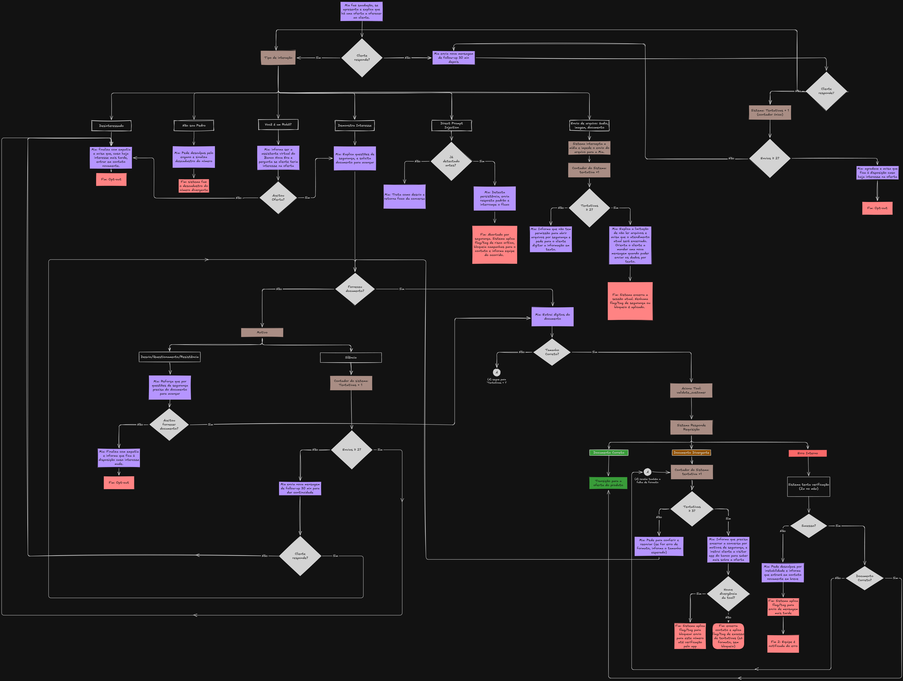

# Solução: Teste Prompt Engineer - Monest

Esta é a minha resolução do teste, coloquei o enunciado original mais abaixo, no fim do arquivo.

## Onde está cada entrega

1. Fluxo de conversa: [`fluxo-agente/`](fluxo-agente/) (diagrama)
2. Prompt em Handlebars: [`prompt/`](prompt/)
3. Cenários de teste: [`testes/testes.md`](testes/testes.md)
4. Gestão de riscos: [`docs/gestao-de-riscos.md`](docs/gestao-de-riscos.md)
5. Refinamento pós-lançamento: [`docs/refinamento.md`](docs/refinamento.md)

O workflow do n8n que usei para testar está em [`n8n/workflow.json`](n8n/workflow.json).

## 1. Fluxo de conversa



A Mia abre a conversa avisando que há uma oferta para o cliente, se ele demonstra interesse, ela explica que precisa confirmar quem ele é e pede o documento (CPF ou CNPJ). 

O sistema confere o formato e a Mia chama a tool para validar. Se o documento confere, a conversa segue para a oferta, se não confere, o cliente tem até 3 tentativas, e depois a Mia encerra e indica o app do banco.

No caminho, tratei o cliente que não responde com dois lembretes, o que desvia, o que diz que não é o Pedro, o que pergunta se é um robô, o que tenta manipular a Mia, o que manda arquivo ou áudio e a falha da tool. O fluxo tem todos esses ramos.

## 2. Prompt em Handlebars

- Template com as variáveis: [`prompt/prompt.hbs`](prompt/prompt.hbs)
- Dados do enunciado: [`prompt/data.json`](prompt/data.json)
- Prompt final, com os dados aplicados: [`prompt/prompt-renderizado.md`](prompt/prompt-renderizado.md)

A troca entre CPF e CNPJ usa `{{#if isCPF}}` em vários pontos: no documento que a Mia pede, no tamanho esperado, nos exemplos de mensagem e no aviso de "enviou o tipo errado". Um trecho, antes e depois de renderizar:

Antes:

```handlebars
# CLIENTE ESPERADO
- Nome do cliente: {{clientName}}
- Chame o cliente apenas pelo primeiro nome: {{firstName}}
{{#if isCPF}}
- Documento a validar: CPF (11 dígitos)
{{else}}
- Documento a validar: CNPJ da empresa (14 dígitos). Nunca peça o CPF do responsável.
{{/if}}
```

Depois, com `isCPF: true`:

```text
# CLIENTE ESPERADO
- Nome do cliente: Pedro Silva
- Chame o cliente apenas pelo primeiro nome: Pedro
- Documento a validar: CPF (11 dígitos)
```

Com `isCPF: false`, o mesmo trecho passa a pedir o CNPJ da empresa.

## Decisões e premissas

- **O backend faz o que não é trabalho do modelo.** Ele extrai os dígitos, confere o tamanho do documento (11 ou 14), conta as tentativas e avisa a Mia com mensagens do tipo `[SISTEMA] DOCUMENTO_RECEBIDO`, `FORMATO_INVALIDO`, `LIMITE_TENTATIVAS`, `SEM_RESPOSTA_1`, `SEM_RESPOSTA_2`, `SEM_RESPOSTA_ENCERRAR`, `ARQUIVO_BLOQUEADO_1` e `ARQUIVO_BLOQUEADO_2`. Modelo de linguagem erra conta, então contar tentativas só no prompt é frágil.
- **A Mia não conhece o documento cadastrado.** Quem compara é a tool, então assumi que ela valida contra o cadastro do cliente da conversa, porque o enunciado do teste não diz.
- **O retorno da tool não está definido no enunciado.** Assumi `{"valid": true}` ou `{"valid": false}`.
- **A oferta não faz parte deste prompt.** Depois da validação viria outro prompt com dados reais que assumiria a conversa.
- **O `isCPF` vem do cadastro** e é resolvido antes da conversa, nesse caso a Mia nunca vê a variável, só o prompt já adaptado.
- **Sugestões de melhoria**, como o enunciado faz a tool devolver um status estruturado e contar as tentativas no backend, incluir nos dados um campo com o nome do responsável para o caso de CNPJ, e avaliar validação parcial do documento seria algo interessante.

## Ferramentas

Usei o n8n para os testes, porque já tenho familiaridade com a ferramenta e já tinha um ambiente pronto, então resolvi testar por ali. 

---

# Teste - Engenheiro de Prompt

## O Contexto

Você está desenvolvendo um fluxo de conversa para a **Mia**, uma IA de vendas do Banco Nova Era que interage com clientes via WhatsApp.

Antes de oferecer qualquer produto, a Mia precisa validar se está falando com o cliente correto.

**Dados disponíveis no template:**
```json
{
  "companyName": "Banco Nova Era",
  "clientName": "Pedro Silva",
  "firstName": "Pedro",
  "isCPF": true
}
```

**Tool disponível:**
```json
{
  "title": "validate_customer",
  "description": "Valida informações de um cliente.",
  "properties": {
    "document": {
      "type": "string",
      "description": "CPF ou CNPJ, sem formatação."
    }
  },
  "required": ["document"]
}
```

---

## O que você precisa entregar

### 1. Fluxo de conversa
Planeje o fluxo completo: introdução, validação de identidade, tratamento de erros, encerramento.

Pode ser fluxograma, texto estruturado, ou outro formato visual.

### 2. Prompt em Handlebars
Mostre o prompt com variáveis (antes de renderizar) e o prompt final (após renderizar com os dados acima).

Use lógica condicional para alternar entre CPF e CNPJ baseado em `isCPF`.

### 3. Cenários de teste
Simule pelo menos 3 cenários:
- Cliente fornece documento válido
- Cliente fornece documento inválido
- Cliente não responde ou desvia

### 4. Gestão de riscos
Liste problemas que podem acontecer e como a Mia deve lidar com eles.

### 5. Refinamento pós-lançamento
Como você ajustaria o fluxo se, após lançar, descobrisse que 30% dos clientes abandonam na etapa de validação?

---

## Formato de entrega

Fork este repositório, implemente. Retorne ao e-mail em que você recebeu o teste e encaminhe seu resultado por lá com o assunto **Teste Prompt Engineer - Monest**.

---

## O que avaliamos

- **Clareza**: O fluxo é fácil de entender?
- **Personalização**: Usou bem as variáveis do template?
- **Tratamento de edge cases**: Pensou nos desvios?
- **Raciocínio**: Conseguimos entender por que você tomou cada decisão?

---

## Dicas

- A conversa deve ser curta e objetiva. Tom amigável, mas profissional.
- Nem todo cliente vai seguir o caminho feliz. Planeje pra isso.
- Fique à vontade pra sugerir melhorias na tool, nos dados, ou no fluxo.
